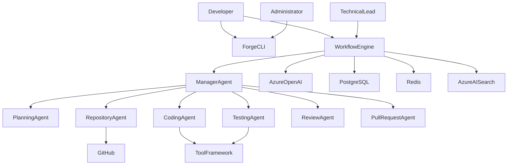

# Actor Specification

| Field | Value |
|-------|-------|
| Document ID | FAI-ACT-001 |
| Project | ForgeAI |
| Document Title | Actor Specification |
| Version | 1.0.0 |
| Status | Draft |
| SDLC Phase | Requirement Engineering |
| Standard | UML 2.5 |
| Parent Document | FAI-UCS-001 |
| Author | ForgeAI Architecture Team |
| Classification | Public |
| Last Updated | 2026-08-02 |

---

# Revision History

| Version | Date | Author | Description |
|----------|------|--------|-------------|
| 1.0.0 | 2026-08-02 | Architecture Team | Initial Actor Specification |

---

# Table of Contents

1. Purpose
2. Scope
3. Actor Classification
4. Primary Actors
5. Secondary Actors
6. External Systems
7. Internal Actors
8. Actor Responsibilities
9. Actor Relationships
10. Actor Permission Matrix
11. Actor Interaction Matrix
12. Requirement Traceability

---

# 1. Purpose

This document defines every actor that interacts with the ForgeAI platform.

Actors represent users, external systems, autonomous AI components, and infrastructure services that participate in business workflows.

This specification serves as the foundation for:

- Use Case Diagrams
- Sequence Diagrams
- Security Architecture
- RBAC Design
- API Authorization
- Workflow Design

---

# 2. Scope

This document covers:

- Human Actors
- External System Actors
- Internal Platform Actors
- AI Actors
- Infrastructure Actors

Implementation details are outside the scope of this document.

---

# 3. Actor Classification

| Category | Description |
|----------|-------------|
| Human | End users interacting with ForgeAI |
| External | Third-party systems |
| Internal | Core ForgeAI services |
| Autonomous | AI agents |
| Infrastructure | Cloud and runtime services |

---

# 4. Primary Actors

---

## ACT-001 Developer

### Description

Primary user of ForgeAI.

Developers use the platform to automate software engineering workflows.

### Responsibilities

- Install ForgeAI
- Connect repositories
- Create workflows
- Review AI output
- Execute engineering tasks
- Configure AI providers
- Monitor workflows

### Goals

- Reduce repetitive engineering work
- Increase productivity
- Maintain software quality

### Permissions

- Read repositories
- Execute workflows
- Approve implementation plans
- View workflow history

---

## ACT-002 Technical Lead

### Description

Engineering reviewer responsible for approving AI-generated work.

### Responsibilities

- Review implementation plans
- Review generated code
- Approve pull requests
- Review audit history

### Goals

- Maintain engineering quality
- Ensure architectural consistency

### Permissions

- Approve workflows
- Reject workflows
- Review generated artifacts

---

## ACT-003 Administrator

### Description

Responsible for configuring and maintaining ForgeAI.

### Responsibilities

- Configure platform
- Configure Azure resources
- Configure models
- Install plugins
- Manage users
- Configure security

### Permissions

- Full administrative access

---

# 5. Secondary Actors

---

## ACT-004 Open Source Contributor

### Description

Contributes improvements to ForgeAI.

### Responsibilities

- Submit Pull Requests
- Report Issues
- Improve documentation
- Develop plugins

---

## ACT-005 Organization Maintainer

### Description

Maintains the ForgeAI GitHub organization.

### Responsibilities

- Review community Pull Requests
- Publish releases
- Maintain roadmap
- Manage repositories

---

# 6. External System Actors

---

## ACT-101 GitHub

### Type

External System

### Responsibilities

- Repository hosting
- Issue management
- Pull Requests
- Git operations
- Authentication

### Communication

REST API

OAuth

Git Protocol

---

## ACT-102 Azure OpenAI

### Type

External AI Provider

### Responsibilities

- LLM inference
- Embedding generation
- Tool calling

---

## ACT-103 Azure AI Search

### Responsibilities

- Vector search
- Semantic search
- Hybrid retrieval

---

## ACT-104 Azure Key Vault

### Responsibilities

- Secret management
- Credential storage

---

## ACT-105 Docker

### Responsibilities

- Container execution
- Local runtime

---

## ACT-106 PostgreSQL

### Responsibilities

- Persistent storage

---

## ACT-107 Redis

### Responsibilities

- Workflow state
- Cache
- Short-term memory

---

# 7. Internal Platform Actors

---

## ACT-201 Forge CLI

### Description

Primary installation and management interface.

Responsibilities

- Setup
- Provision Azure
- Generate configuration
- Validate environment

---

## ACT-202 Workflow Engine

### Responsibilities

- Execute workflows
- Maintain workflow state
- Coordinate AI agents

---

## ACT-203 Tool Execution Framework

### Responsibilities

- Execute approved tools
- Validate permissions
- Audit execution

---

## ACT-204 Memory Service

### Responsibilities

- Store workflow memory
- Retrieve engineering context

---

## ACT-205 Observability Service

### Responsibilities

- Logs
- Metrics
- Traces
- Audit events

---

# 8. Autonomous AI Actors

---

## AGT-001 Manager Agent

### Purpose

Coordinates all engineering workflows.

### Responsibilities

- Plan workflow execution
- Dispatch agents
- Monitor workflow state

Never writes source code directly.

---

## AGT-002 Repository Analysis Agent

### Responsibilities

- Analyze repository
- Build dependency graph
- Generate repository intelligence

---

## AGT-003 Planning Agent

### Responsibilities

- Understand GitHub Issues
- Produce implementation plans
- Estimate complexity

---

## AGT-004 Retrieval Agent

### Responsibilities

- Retrieve repository context
- Query vector database
- Build LLM context

---

## AGT-005 Coding Agent

### Responsibilities

- Generate source code
- Modify files
- Refactor implementation

---

## AGT-006 Build Agent

### Responsibilities

- Execute build
- Parse compiler output

---

## AGT-007 Testing Agent

### Responsibilities

- Execute tests
- Analyze failures

---

## AGT-008 Debug Agent

### Responsibilities

- Investigate failures
- Retry implementation

---

## AGT-009 Documentation Agent

### Responsibilities

- Generate documentation
- Update Markdown
- Produce release notes

---

## AGT-010 Review Agent

### Responsibilities

- Evaluate implementation
- Verify coding standards
- Detect architectural violations

---

## AGT-011 Pull Request Agent

### Responsibilities

- Generate commits
- Create Pull Requests
- Produce PR summaries

---

# 9. Actor Relationships



---

# 10. Actor Permission Matrix

| Capability | Developer | Tech Lead | Administrator |
|------------|-----------|-----------|---------------|
| Install ForgeAI | ✔ | ✔ | ✔ |
| Configure Azure | ✔ | ✔ | ✔ |
| Execute Workflow | ✔ | ✔ | ✔ |
| Approve Workflow | ✔ | ✔ | ✔ |
| Configure Models | ✖ | ✖ | ✔ |
| Install Plugins | ✖ | ✖ | ✔ |
| View Audit Logs | ✖ | ✔ | ✔ |
| Configure Security | ✖ | ✖ | ✔ |
| Manage Users | ✖ | ✖ | ✔ |

---

# 11. Actor Interaction Matrix

| Actor | GitHub | Azure | Workflow | AI Agents | Tool Framework |
|--------|---------|--------|-----------|------------|----------------|
| Developer | ✔ | ✔ | ✔ | ✔ | ✖ |
| Technical Lead | ✔ | ✖ | ✔ | ✔ | ✖ |
| Administrator | ✔ | ✔ | ✔ | ✔ | ✔ |
| Workflow Engine | ✔ | ✔ | ✔ | ✔ | ✔ |
| AI Agents | ✔ | ✔ | ✔ | ✔ | ✔ |

---

# 12. Requirement Traceability

| SRS Requirement | Actors |
|-----------------|--------|
| FR-001–FR-004 | Developer, GitHub |
| FR-005–FR-012 | Repository Analysis Agent |
| FR-013–FR-020 | Manager Agent, Planning Agent, Coding Agent |
| FR-021–FR-024 | Build Agent, Testing Agent |
| FR-025–FR-030 | Pull Request Agent, Technical Lead |
| FR-031–FR-033 | Forge CLI, Azure |
| FR-034–FR-037 | Observability Service |
| FR-038–FR-040 | Administrator, Plugin Framework |

---

# Appendix A — Actor Hierarchy

```text
Actors
│
├── Human
│   ├── Developer
│   ├── Technical Lead
│   ├── Administrator
│   ├── Contributor
│   └── Organization Maintainer
│
├── External Systems
│   ├── GitHub
│   ├── Azure OpenAI
│   ├── Azure AI Search
│   ├── Azure Key Vault
│   ├── Docker
│   ├── PostgreSQL
│   └── Redis
│
├── Internal Platform
│   ├── Forge CLI
│   ├── Workflow Engine
│   ├── Tool Framework
│   ├── Memory Service
│   └── Observability Service
│
└── AI Agents
    ├── Manager Agent
    ├── Planning Agent
    ├── Repository Agent
    ├── Retrieval Agent
    ├── Coding Agent
    ├── Build Agent
    ├── Testing Agent
    ├── Debug Agent
    ├── Documentation Agent
    ├── Review Agent
    └── Pull Request Agent
```

---

**End of Document**