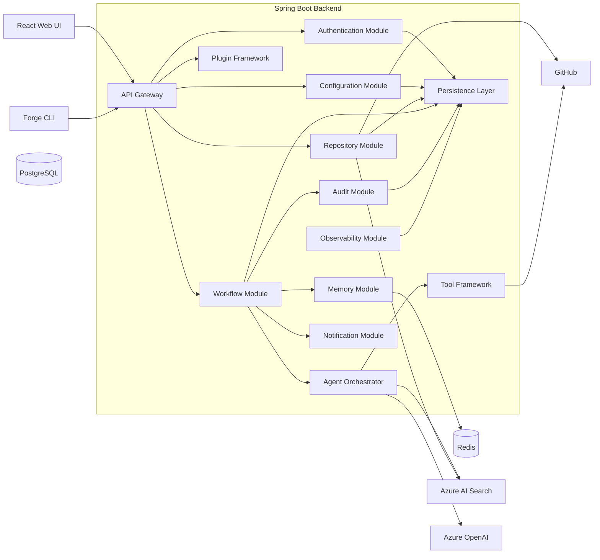

# Component Diagram (C4 Model - Level 3)

| Field | Value |
|-------|-------|
| Document ID | FAI-ARC-003 |
| Project | ForgeAI |
| Document Title | Component Diagram |
| Version | 1.0.0 |
| Status | Draft |
| SDLC Phase | High-Level Design |
| Standard | C4 Model – Level 3 |
| Parent Document | FAI-ARC-002 |
| Author | ForgeAI Architecture Team |
| Classification | Public |
| Last Updated | 2026-08-02 |

---

# Revision History

| Version | Date | Author | Description |
|----------|------|--------|-------------|
| 1.0.0 | 2026-08-02 | Architecture Team | Initial Component Architecture |

---

# Table of Contents

1. Purpose
2. Scope
3. Architectural Overview
4. Component Responsibilities
5. Component Diagram
6. Component Interactions
7. Internal Request Flow
8. Design Principles
9. Technology Stack
10. Requirement Traceability

---

# 1. Purpose

This document decomposes the **Spring Boot Backend** into logical software components.

Each component represents a cohesive module with a well-defined responsibility.

This document intentionally excludes:

- Class design
- Database schema
- API contracts
- Sequence flows

Those artifacts are defined in later SDLC phases.

---

# 2. Scope

Included

- Backend modules
- Internal communication
- Service responsibilities
- Repository boundaries

Excluded

- Entity classes
- DTOs
- REST endpoints
- Database tables
- Agent internals

---

# 3. Architectural Overview

ForgeAI follows a **Modular Monolith Architecture** for Version 1.0.

Although deployed as a single Spring Boot application, each module is isolated through package boundaries and interfaces.

This architecture enables future migration toward microservices without major refactoring.

---

# 4. Component Responsibilities

| ID | Component | Responsibility |
|----|-----------|----------------|
| CMP-001 | API Gateway | Entry point for all client requests |
| CMP-002 | Authentication Module | User authentication and authorization |
| CMP-003 | Repository Module | Repository management and indexing |
| CMP-004 | Workflow Module | Workflow lifecycle management |
| CMP-005 | Agent Orchestrator | Coordinates AI agents |
| CMP-006 | Memory Module | Long-term and short-term memory |
| CMP-007 | Tool Framework | Secure execution of external tools |
| CMP-008 | Plugin Framework | Plugin discovery and execution |
| CMP-009 | Configuration Module | System configuration |
| CMP-010 | Audit Module | Security and audit logging |
| CMP-011 | Observability Module | Logs, metrics, traces |
| CMP-012 | Notification Module | User notifications |
| CMP-013 | Persistence Layer | Database access |

---

# 5. Component Diagram



---

# 6. Component Descriptions

---

## CMP-001 API Gateway

### Responsibilities

- REST APIs
- Request validation
- Authentication delegation
- Response formatting
- Error handling

---

## CMP-002 Authentication Module

### Responsibilities

- GitHub OAuth
- Azure Authentication
- JWT validation
- Session management
- RBAC

---

## CMP-003 Repository Module

### Responsibilities

- Clone repositories
- Synchronize repositories
- Repository metadata
- Repository indexing
- Branch management

---

## CMP-004 Workflow Module

### Responsibilities

- Workflow lifecycle
- Workflow scheduling
- Approval checkpoints
- Retry policies
- Execution history

---

## CMP-005 Agent Orchestrator

### Responsibilities

- Execute Manager Agent
- Coordinate specialized agents
- Dispatch agent tasks
- Aggregate results
- Maintain execution order

---

## CMP-006 Memory Module

### Responsibilities

- Repository memory
- Conversation memory
- Workflow memory
- Context retrieval

---

## CMP-007 Tool Framework

### Responsibilities

- Git execution
- Docker execution
- Filesystem access
- Browser automation
- Command execution
- Tool permissions

---

## CMP-008 Plugin Framework

### Responsibilities

- Plugin discovery
- Plugin loading
- Plugin lifecycle
- Dependency isolation
- SDK registration

---

## CMP-009 Configuration Module

### Responsibilities

- Environment configuration
- AI provider configuration
- Plugin configuration
- User preferences

---

## CMP-010 Audit Module

### Responsibilities

- Audit events
- Security logging
- Compliance reporting
- Change history

---

## CMP-011 Observability Module

### Responsibilities

- Structured logging
- Metrics
- Distributed tracing
- Health checks

---

## CMP-012 Notification Module

### Responsibilities

- Workflow updates
- Approval requests
- Error notifications
- Build notifications

---

## CMP-013 Persistence Layer

### Responsibilities

- Repository abstraction
- Transactions
- Entity persistence
- Query execution

---

# 7. Internal Request Flow

```text
User Request

↓

API Gateway

↓

Authentication

↓

Workflow Module

↓

Agent Orchestrator

↓

Tool Framework

↓

Repository Module

↓

Persistence Layer

↓

Response
```

---

# 8. Design Principles

## DP-001

Each component shall have a single responsibility.

---

## DP-002

Components shall communicate only through well-defined interfaces.

---

## DP-003

Business logic shall not directly access infrastructure dependencies.

---

## DP-004

External systems shall be accessed only through adapter interfaces.

---

## DP-005

AI agents shall never directly modify repositories.

Repository modifications shall always pass through the Tool Framework.

---

## DP-006

Infrastructure concerns shall remain isolated from business logic.

---

# 9. Technology Stack

| Component | Technology |
|------------|------------|
| API Gateway | Spring Boot REST |
| Authentication | Spring Security |
| Repository Module | JGit |
| Workflow Module | LangGraph4j |
| Agent Orchestrator | Spring AI |
| Memory Module | Redis |
| Tool Framework | Java Process API |
| Plugin Framework | Java SPI |
| Persistence | Spring Data JPA |
| Database | PostgreSQL |
| Cache | Redis |
| Search | Azure AI Search |
| AI Provider | Azure OpenAI |
| Logging | SLF4J + Logback |
| Metrics | Micrometer |
| Tracing | OpenTelemetry |

---

# 10. Requirement Traceability

| Requirement | Components |
|-------------|------------|
| FR-001–FR-004 | API Gateway, Authentication |
| FR-005–FR-012 | Repository Module |
| FR-013–FR-020 | Workflow Module, Agent Orchestrator |
| FR-021–FR-024 | Tool Framework |
| FR-025–FR-030 | Repository Module, Workflow Module |
| FR-031–FR-033 | Configuration Module |
| FR-034–FR-037 | Audit Module, Observability Module |
| FR-038–FR-040 | Plugin Framework |

---

# Notes

This document represents **C4 Model Level 3 (Component Diagram)** for the **Spring Boot Backend**.

The next document (**FAI-ARC-004 – Deployment Diagram**) will describe how ForgeAI is deployed across the developer workstation and Azure infrastructure, including Docker containers, networking, persistent storage, and external Azure services.

---

**End of Document**