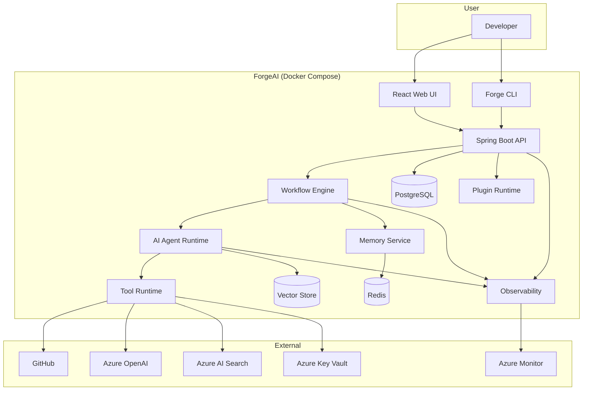

# Container Diagram (C4 Model - Level 2)

| Field | Value |
|-------|-------|
| Document ID | FAI-ARC-002 |
| Project | ForgeAI |
| Document Title | Container Diagram |
| Version | 1.0.0 |
| Status | Draft |
| SDLC Phase | High-Level Design |
| Standard | C4 Model – Level 2 |
| Parent Document | FAI-ARC-001 |
| Author | ForgeAI Architecture Team |
| Classification | Public |
| Last Updated | 2026-08-02 |

---

# Revision History

| Version | Date | Author | Description |
|----------|------|--------|-------------|
| 1.0.0 | 2026-08-02 | Architecture Team | Initial Container Architecture |

---

# Table of Contents

1. Purpose
2. Scope
3. Architectural Overview
4. Container Responsibilities
5. Container Diagram
6. Container Communication
7. Data Flow
8. Technology Stack
9. Deployment Responsibilities
10. Design Decisions
11. Constraints
12. Requirement Traceability

---

# 1. Purpose

This document decomposes the ForgeAI Platform into independently deployable containers.

Each container represents an independently deployable runtime responsible for a specific business capability.

This document intentionally omits implementation details, internal components, and class-level design.

---

# 2. Scope

Included:

- Deployable containers
- External systems
- Databases
- Communication channels
- Technology stack

Excluded:

- Internal services
- APIs
- Class diagrams
- Database schema
- Workflow implementation

---

# 3. Architectural Overview

ForgeAI follows a modular, service-oriented architecture while remaining deployable as a self-hosted Docker Compose application.

Each container has a single responsibility and communicates using well-defined interfaces.

The platform is designed to evolve toward Kubernetes deployment without requiring architectural changes.

---

# 4. Container Responsibilities

| Container | Responsibility |
|------------|----------------|
| Web UI | User interface |
| Backend API | API Gateway and business orchestration |
| Workflow Engine | Executes engineering workflows |
| AI Runtime | Executes AI agents |
| Memory Service | Stores workflow memory |
| Tool Runtime | Executes approved tools |
| Plugin Runtime | Loads community plugins |
| PostgreSQL | Persistent storage |
| Redis | Cache and workflow state |
| Vector Store | Semantic repository search |
| Observability | Logs, metrics, traces |

---

# 5. Container Diagram



---

# 6. Container Descriptions

---

## C-001 Web UI

### Technology

- React
- Next.js
- Tailwind CSS

### Responsibilities

- Dashboard
- Repository Explorer
- Workflow Visualization
- Pull Request Review
- Settings
- Authentication

---

## C-002 Forge CLI

### Technology

Go (preferred) or Java

### Responsibilities

- Installation
- Azure Authentication
- Resource Provisioning
- Environment Generation
- Diagnostics
- Upgrade Management

---

## C-003 Backend API

### Technology

Spring Boot

### Responsibilities

- REST API
- Authentication
- Business Logic
- Workflow Management
- Configuration
- Repository Management

---

## C-004 Workflow Engine

### Technology

LangGraph

### Responsibilities

- Execute workflows
- Maintain workflow state
- Coordinate agents
- Retry failed tasks
- Human approval

---

## C-005 AI Runtime

### Responsibilities

Execute:

- Manager Agent
- Planning Agent
- Repository Agent
- Retrieval Agent
- Coding Agent
- Build Agent
- Testing Agent
- Review Agent
- Documentation Agent
- Pull Request Agent

---

## C-006 Tool Runtime

### Responsibilities

Execute approved tools.

Supported tools:

- Git
- GitHub
- Docker
- Maven
- Gradle
- Filesystem
- Browser
- Terminal

---

## C-007 Memory Service

### Responsibilities

- Short-term memory
- Long-term memory
- Repository context
- Workflow history

---

## C-008 Plugin Runtime

### Responsibilities

- Plugin discovery
- Plugin loading
- Dependency isolation
- Extension registration

---

## C-009 PostgreSQL

### Stores

- Users
- Workflows
- Repository Metadata
- Configuration
- Audit Logs
- Agent Executions

---

## C-010 Redis

### Stores

- Cache
- Session
- Workflow State
- Short-Term Memory

---

## C-011 Vector Store

### Stores

- Repository embeddings
- Documentation embeddings
- Code embeddings
- Semantic indexes

---

## C-012 Observability

### Responsibilities

- Logging
- Metrics
- Distributed Tracing
- Alerts

---

# 7. Container Communication

| Source | Destination | Protocol |
|----------|-------------|----------|
| Web UI | Backend API | HTTPS REST |
| CLI | Backend API | HTTPS REST |
| Backend API | Workflow Engine | Internal |
| Workflow Engine | AI Runtime | Internal |
| AI Runtime | Tool Runtime | Internal |
| AI Runtime | Azure OpenAI | HTTPS |
| AI Runtime | Azure AI Search | HTTPS |
| Tool Runtime | GitHub | HTTPS REST |
| Backend API | PostgreSQL | JDBC |
| Memory Service | Redis | TCP |
| AI Runtime | Vector Store | Internal |
| Observability | Azure Monitor | HTTPS |

---

# 8. Data Flow

## Repository Analysis
```
Developer

↓

Backend API

↓

Workflow Engine

↓

Repository Agent

↓

GitHub

↓

Repository Metadata

↓

Vector Store

↓

Workflow Ready
```

---

## AI Workflow
```
Developer

↓

Workflow Engine

↓

Planning Agent

↓

Coding Agent

↓

Testing Agent

↓

Review Agent

↓

Pull Request Agent

↓

GitHub

```
---

# 9. Technology Stack

| Container | Technology |
|------------|------------|
| UI | React + Next.js |
| Backend | Spring Boot |
| Workflow | LangGraph |
| AI Runtime | Spring AI + LangGraph |
| Database | PostgreSQL |
| Cache | Redis |
| Search | Azure AI Search |
| LLM | Azure OpenAI |
| CLI | Java |
| Deployment | Docker Compose |

---

# 10. Design Decisions

| ID | Decision |
|----|----------|
| DD-001 | Containers shall be independently replaceable. |
| DD-002 | AI execution shall be isolated from business logic. |
| DD-003 | Workflow orchestration shall remain stateful. |
| DD-004 | Plugin execution shall be sandboxed. |
| DD-005 | Vector search shall be abstracted behind a repository interface. |
| DD-006 | Infrastructure dependencies shall remain external to the platform. |

---

# 11. Constraints

| ID | Constraint |
|----|------------|
| C-001 | All containers shall support Docker deployment. |
| C-002 | Platform shall execute on a single developer workstation. |
| C-003 | Azure services shall remain customer-owned. |
| C-004 | Container communication shall remain encrypted where applicable. |
| C-005 | Containers shall support horizontal scaling in future Kubernetes deployments. |

---

# 12. Requirement Traceability

| Requirement | Containers |
|-------------|------------|
| FR-001–FR-004 | Backend API |
| FR-005–FR-012 | Workflow Engine, AI Runtime |
| FR-013–FR-024 | AI Runtime, Tool Runtime |
| FR-025–FR-030 | Backend API, Tool Runtime |
| FR-031–FR-033 | Forge CLI |
| FR-034–FR-037 | Observability |
| FR-038–FR-040 | Plugin Runtime |

---

# Notes

This document represents **C4 Model Level 2 (Container Diagram).**

The next document (**FAI-ARC-003 – Component Diagram**) will decompose the **Spring Boot Backend** into its internal modules, including:

- API Gateway
- Authentication Module
- Repository Module
- Workflow Module
- Agent Orchestrator
- Memory Module
- Tool Framework
- Plugin Framework
- Configuration Module
- Observability Module

---

**End of Document**