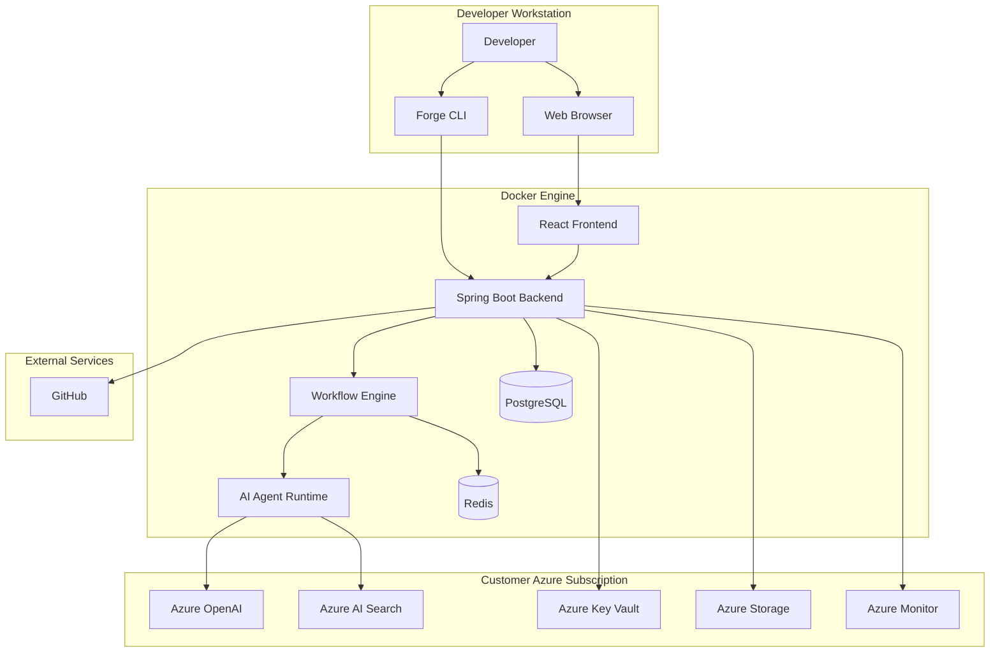

# Deployment Diagram

| Field | Value |
|-------|-------|
| Document ID | FAI-ARC-004 |
| Project | ForgeAI |
| Document Title | Deployment Diagram |
| Version | 1.0.0 |
| Status | Draft |
| SDLC Phase | High-Level Design |
| Standard | UML Deployment Diagram (Conceptual) |
| Parent Document | FAI-ARC-003 |
| Author | ForgeAI Architecture Team |
| Classification | Public |
| Last Updated | 2026-08-02 |

---

# Revision History

| Version | Date | Author | Description |
|----------|------|--------|-------------|
| 1.0.0 | 2026-08-02 | Architecture Team | Initial Deployment Architecture |

---

# Table of Contents

1. Purpose
2. Scope
3. Deployment Overview
4. Deployment Topology
5. Deployment Diagram
6. Deployment Nodes
7. Network Architecture
8. Persistent Storage
9. Runtime Configuration
10. Security Zones
11. Design Decisions
12. Deployment Constraints
13. Requirement Traceability

---

# 1. Purpose

This document defines the physical deployment architecture of ForgeAI.

It describes how the platform is deployed across:

- Developer Workstation
- Docker Runtime
- Customer Azure Subscription
- External Systems

This document focuses on deployment topology and runtime infrastructure.

Implementation details are intentionally excluded.

---

# 2. Scope

Included

- Physical deployment
- Runtime nodes
- Containers
- Databases
- Azure resources
- Network communication
- Persistent volumes

Excluded

- Component implementation
- APIs
- Class design
- Database schema
- Business workflows

---

# 3. Deployment Overview

ForgeAI follows a **Local-First Deployment Model**.

The application executes entirely on the user's workstation while securely communicating with Azure resources provisioned within the user's Azure subscription.

No ForgeAI-managed infrastructure exists.

All compute, secrets, AI resources, and storage remain under customer ownership.

---

# 4. Deployment Topology

The deployment consists of four logical environments.

| Environment | Description |
|------------|-------------|
| Developer Workstation | Local execution environment |
| Docker Runtime | ForgeAI application containers |
| Azure Subscription | AI and managed cloud resources |
| External Services | GitHub and other third-party integrations |

---

# 5. Deployment Diagram



---

# 6. Deployment Nodes

---

## Node-001 Developer Workstation

### Responsibilities

- Execute Forge CLI
- Access Web UI
- Manage repositories
- Review AI output

### Software

- Git
- Docker Desktop
- Azure CLI
- Forge CLI
- Browser

---

## Node-002 Docker Engine

### Responsibilities

- Execute all ForgeAI containers
- Maintain internal networking
- Mount persistent volumes
- Provide service isolation

### Containers

- React Frontend
- Spring Boot Backend
- Workflow Engine
- AI Runtime
- PostgreSQL
- Redis

---

## Node-003 Azure Subscription

### Responsibilities

- AI inference
- Semantic retrieval
- Secret management
- Artifact storage
- Monitoring

### Services

- Azure OpenAI
- Azure AI Search
- Azure Key Vault
- Azure Storage
- Azure Monitor

---

## Node-004 GitHub

### Responsibilities

- Repository hosting
- Issue management
- Pull Requests
- Git operations

---

# 7. Network Architecture

## Local Network

```text
Browser
    │
HTTPS
    │
React Frontend
    │
REST
    │
Spring Boot Backend
```

---

## Internal Docker Network

```text
Backend
   │
   ├── Workflow Engine
   ├── AI Runtime
   ├── PostgreSQL
   └── Redis
```

Containers communicate through an isolated Docker bridge network.

---

## External Network

```text
Backend
      │
 HTTPS / TLS
      │
 Azure Services
      │
 GitHub
```

Only outbound HTTPS traffic is required.

No inbound cloud connectivity is required.

---

# 8. Persistent Storage

## PostgreSQL

Stores:

- Users
- Repository metadata
- Workflow history
- Audit logs
- Configuration
- Agent execution history

---

## Redis

Stores:

- Workflow state
- Session cache
- Short-term memory
- Temporary execution data

---

## Azure Storage

Stores:

- Generated documentation
- Reports
- Workflow artifacts
- Attachments

---

# 9. Runtime Configuration

Configuration is generated automatically by the Forge CLI during setup.

Primary configuration sources include:

- Azure CLI authentication
- Azure Key Vault
- Generated environment variables
- Docker Compose configuration

Typical runtime configuration includes:

- Azure OpenAI endpoint
- Azure AI Search endpoint
- Database connection
- Redis connection
- GitHub OAuth configuration

---

# 10. Security Zones

## Zone 1

Developer Machine

Contains:

- Browser
- Forge CLI
- Local repositories

---

## Zone 2

Docker Network

Contains:

- ForgeAI services
- Databases
- Workflow execution

Accessible only through internal container networking.

---

## Zone 3

Customer Azure Subscription

Contains:

- AI services
- Secrets
- Monitoring
- Storage

Managed entirely by the customer.

---

## Zone 4

External Internet

Contains:

- GitHub

All communication uses encrypted HTTPS connections.

---

# 11. Design Decisions

| ID | Decision |
|----|----------|
| DD-001 | ForgeAI shall execute locally. |
| DD-002 | Docker Compose shall be the default deployment model. |
| DD-003 | Azure resources shall remain customer-owned. |
| DD-004 | Only outbound HTTPS traffic shall be required. |
| DD-005 | Configuration shall be generated automatically. |
| DD-006 | Containers shall be independently replaceable. |
| DD-007 | Future Kubernetes deployment shall require minimal architectural changes. |

---

# 12. Deployment Constraints

| ID | Constraint |
|----|------------|
| DC-001 | Docker Desktop is required. |
| DC-002 | Azure CLI is required for initial provisioning. |
| DC-003 | Azure Subscription is required. |
| DC-004 | GitHub account is required. |
| DC-005 | Internet connectivity is required for Azure services. |
| DC-006 | Customer infrastructure shall never be managed by ForgeAI cloud services. |

---

# 13. Requirement Traceability

| Requirement | Deployment Element |
|-------------|--------------------|
| FR-001 | Developer Workstation |
| FR-002 | Azure CLI |
| FR-003 | GitHub |
| FR-013 | Workflow Engine |
| FR-021 | AI Runtime |
| FR-031 | Forge CLI |
| FR-034 | Azure Monitor |
| NFR-003 | Docker Runtime |
| NFR-006 | Azure Key Vault |
| NFR-013 | Docker Compose |

---

# Notes

This document completes the **High-Level Deployment Architecture**.

The next phase transitions from High-Level Design (HLD) to **Low-Level Design (LLD)**.

The next document (**FAI-LLD-001 – Low-Level Design**) will define:

- Package structure
- Module boundaries
- Domain-driven architecture
- Design patterns
- Layered architecture
- Dependency rules
- Package conventions
- Coding standards
- Internal interfaces

---

**End of Document**