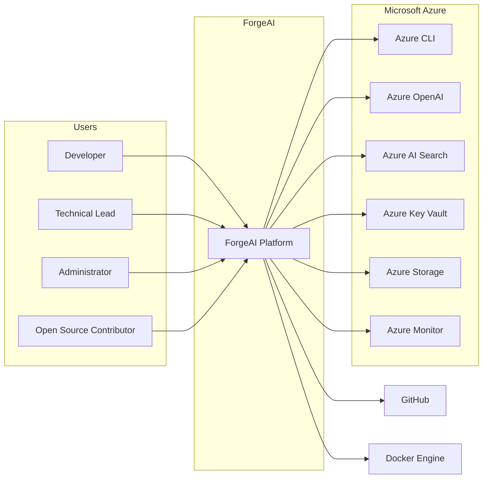

# System Context Diagram (C4 Model - Level 1)

| Field | Value |
|-------|-------|
| Document ID | FAI-ARC-001 |
| Project | ForgeAI |
| Document Title | System Context Diagram |
| Version | 1.0.1 |
| Status | Draft |
| SDLC Phase | High-Level Design |
| Standard | C4 Model – Level 1 |
| Parent Document | FAI-SRS-001 |
| Author | ForgeAI Architecture Team |
| Classification | Public |
| Last Updated | 2026-08-02 |

---

# Revision History

| Version | Date | Author | Description |
|----------|------|--------|-------------|
| 1.0.0 | 2026-08-02 | Architecture Team | Initial Document |
| 1.0.1 | 2026-08-02 | Architecture Team | Updated Mermaid diagram for GitHub compatibility |

---

# Table of Contents

1. Purpose
2. Scope
3. System Context
4. Primary Actors
5. External Systems
6. System Context Diagram
7. System Boundary
8. External Interfaces
9. Architectural Decisions
10. Constraints
11. Requirement Traceability

---

# 1. Purpose

The System Context Diagram provides the highest-level architectural view of ForgeAI and illustrates how external actors and third-party systems interact with the platform.

This document is the first architecture artifact in the High-Level Design (HLD) phase and serves as the foundation for the subsequent Container, Component, and Deployment diagrams.

---

# 2. Scope

This document includes:

- Human actors
- External systems
- ForgeAI platform
- High-level interactions
- System boundaries

This document excludes:

- Internal services
- Containers
- Components
- Databases
- APIs
- Workflow execution

Those topics are covered in subsequent HLD documents.

---

# 3. System Context

ForgeAI is an open-source, self-hosted autonomous software engineering platform that enables developers to automate software engineering workflows using specialized AI agents.

Unlike SaaS platforms, ForgeAI executes entirely within customer-controlled infrastructure.

The platform provisions and consumes Azure AI services directly within the customer's Azure subscription while integrating with GitHub for software development workflows.

ForgeAI never stores customer repositories, credentials, or AI traffic on infrastructure owned by the ForgeAI project.

---

# 4. Primary Actors

| Actor | Description |
|--------|-------------|
| Developer | Primary user responsible for executing AI engineering workflows. |
| Technical Lead | Reviews implementation plans and generated Pull Requests. |
| Administrator | Configures ForgeAI, Azure resources, plugins, and platform settings. |
| Open Source Contributor | Contributes code, documentation, and plugins to ForgeAI. |

---

# 5. External Systems

| ID | External System | Purpose |
|----|-----------------|---------|
| ES-001 | GitHub | Source control, repositories, issues, and pull requests |
| ES-002 | Azure OpenAI | Large Language Model inference |
| ES-003 | Azure AI Search | Semantic and vector search |
| ES-004 | Azure Key Vault | Secure secret management |
| ES-005 | Azure Storage | Artifact and document storage |
| ES-006 | Azure Monitor | Monitoring and telemetry |
| ES-007 | Azure CLI | Authentication and Azure provisioning |
| ES-008 | Docker Engine | Local container runtime |

---

# 6. System Context Diagram

---

# 7. System Boundary

## ForgeAI Boundary

The following capabilities are implemented by ForgeAI:

- Web User Interface
- Forge CLI
- AI Workflow Engine
- Multi-Agent Runtime
- Repository Intelligence
- Tool Execution Framework
- Memory Management
- Plugin Framework
- Observability Services

---

## External Boundary

The following services remain outside the ForgeAI platform boundary:

- GitHub
- Azure OpenAI
- Azure AI Search
- Azure Key Vault
- Azure Storage
- Azure Monitor
- Azure CLI
- Docker Engine

ForgeAI communicates with these services using secure APIs and authenticated connections.

---

# 8. External Interfaces

## GitHub

### Responsibilities

- Repository Hosting
- Git Operations
- Issue Management
- Pull Requests
- OAuth Authentication

### Communication

- Git
- HTTPS REST API
- OAuth 2.0

---

## Azure OpenAI

### Responsibilities

- Chat Completion
- Structured Output
- Tool Calling
- Embedding Generation

### Communication

- HTTPS REST API

---

## Azure AI Search

### Responsibilities

- Vector Search
- Semantic Search
- Hybrid Retrieval

---

## Azure Key Vault

### Responsibilities

- Secret Storage
- Key Management
- Credential Retrieval

---

## Azure Storage

### Responsibilities

- Artifact Storage
- Workflow Files
- Generated Documentation

---

## Azure Monitor

### Responsibilities

- Metrics
- Logs
- Distributed Traces
- Alerts

---

## Azure CLI

### Responsibilities

- User Authentication
- Subscription Management
- Infrastructure Provisioning

---

## Docker Engine

### Responsibilities

- Container Execution
- Local Runtime
- Service Orchestration

---

# 9. Architectural Decisions

| ID | Decision |
|----|----------|
| AD-001 | ForgeAI shall be completely open source. |
| AD-002 | ForgeAI shall execute entirely within customer-owned infrastructure. |
| AD-003 | ForgeAI shall never proxy customer AI requests. |
| AD-004 | Azure resources shall be provisioned directly into the customer's Azure subscription. |
| AD-005 | Customer secrets shall never leave customer-controlled infrastructure. |
| AD-006 | All infrastructure shall be reproducible using Infrastructure as Code. |

---

# 10. Constraints

| ID | Constraint |
|----|------------|
| C-001 | Docker Desktop is required for local deployment. |
| C-002 | Azure Subscription is required for AI capabilities. |
| C-003 | GitHub account is required for repository integration. |
| C-004 | Azure CLI is required for infrastructure provisioning. |
| C-005 | Internet connectivity is required for Azure services. |

---

# 11. Requirement Traceability

| Requirement | Related Elements |
|-------------|------------------|
| FR-001 | Developer Authentication |
| FR-002 | Azure CLI |
| FR-003 | GitHub Integration |
| FR-013 | ForgeAI Platform |
| FR-031 | Azure Provisioning |
| NFR-006 | Azure Key Vault |
| NFR-013 | Docker Runtime |

---

# Notes

This document represents **C4 Model Level 1 (System Context)**.

The next document (**FAI-ARC-002 – Container Diagram**) decomposes the ForgeAI Platform into its primary deployable containers, including:

- React Frontend
- Spring Boot Backend
- Workflow Engine
- Agent Runtime
- PostgreSQL
- Redis
- Forge CLI
- Plugin Runtime
- Observability Stack

---

**End of Document**